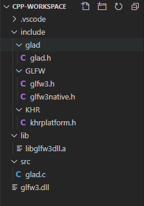
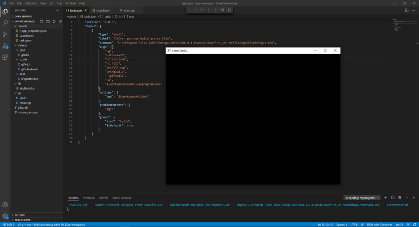
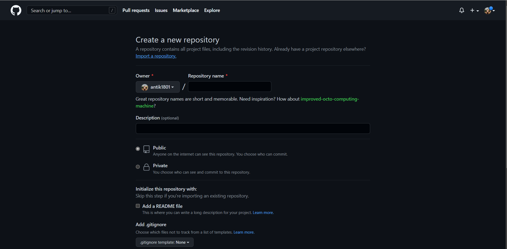

# London City

## Steps:

## 1) Download codeblocks from <a href="https://www.codeblocks.org/">https://www.codeblocks.org/</a> or

## Visual studio code(recommended): <a href="https://code.visualstudio.com/">https://code.visualstudio.com/</a>

## 2) For VS codes setup opengl following tutorial

<a href="https://medium.com/@vivekjha92/setup-opengl-with-vs-code-82852c653c43">https://medium.com/@vivekjha92/setup-opengl-with-vs-code-82852c653c43</a>

## The setup youtube link:

<video src="https://www.youtube.com/watch?v=Pco3EysB5Zu" controls></video><br>
<a href="https://www.youtube.com/watch?v=Pco3EysB5Zu">https://www.youtube.com/watch?v=Pco3EysB5Zu </a>

# Next step:

<p style="font-width: 2rem;">To run OpenGL with VSCode we would need couple of things to setup, but if you want to skip through the whole setup, you can just head over to the end of this article and get the repo, clone it and get started. Else, just hear me out, how did I manage to pull it through.</p>

<ul>
<li> <h2>GLFW:</h2> Now if you have read the getting started section of LearnOpenGL, then you know we also need GLFW, download the pre-compiled binaries from here. </li>
<li><h2>GLAD: </h2>Similarly, download GLAD from this link. If you are downloading GLAD for first time, make sure you have set language to c/c++ and specification to OpenGL. In the API section set gl version 3.3 or above, profile to core and leave extensions empty. Tick the Generate a loader option and click on Generate.</li>
<li><h2>Visual Studio Code and MinGW:</h2>
Yes, of course we would need Visual Studio Code installed in our system. We would also need a c++ compiler, in this case we will use GCC. Follow the prerequisites section of this page step by step to setup the compiler and the c/c++ extension. Also, you should learn how to create the tasks.json file for the c++ project. This would come handy at later stage.
</li>
</ul>

# Organizing Workspace

Now, we have everything we need, so, we need to create a cpp workspace in VSCode, if you are doing this for first time follow the “Hello World” section of this page. Make sure you also know how to create a tasks.json file for cpp project, if not then you can check this link. Now we would add all the files we downloaded in previous steps to our workspace.
At this point your cpp workspace should look like this.


<p style="color:gray">Workspace preview</p>

Now we will follow the Hello Window steps from LearnOpenGL and create our first script main.cpp, add it to the src folder (I like things organised 😊).

# Hello World:

## The final step, in your tasks.json update your “args” field with the following code

```javascript
"args": [
    "-g",
    "-std=c++17",
    "-I./include",
    "-L./lib",
    "src/\\*.cpp",
    "src/glad.c",
    "-lglfw3dll",
    "-o",
    "${workspaceFolder}/myprogram.exe"
]
```

Now, goto VSCode menu, select Run/Run Without Debugging and voila you should see a blank window popup appear just like the image below.

</img>

## Congratulations!! You are now all setup to dive in OpenGL world with VSCode. You can also find the whole source code at this repo..

# Github Uploader command

## step1: Create a repository and make it public/private.

</img>

## Step2: Give the repository name and make it public/ private.

 
 
 <br>
 
 
 <h1>Github commund: </h1>

```
git init
```

Initializing .git file.

```
git add .
```

Staging all git untrack file.

```
git commit -m "<message>"
```

commiting file

```
git remote add oriigin <git ripo link>
```

Adding git file to github repository

```
git remote add origin maste
```

# Author

## Gazi Ehsanul Haque

## American international University Bangladesh

## +8801869694519

## 18-36572-1@student.aiub.edu

 </img>

# Thankyou all Please contact any further query.
